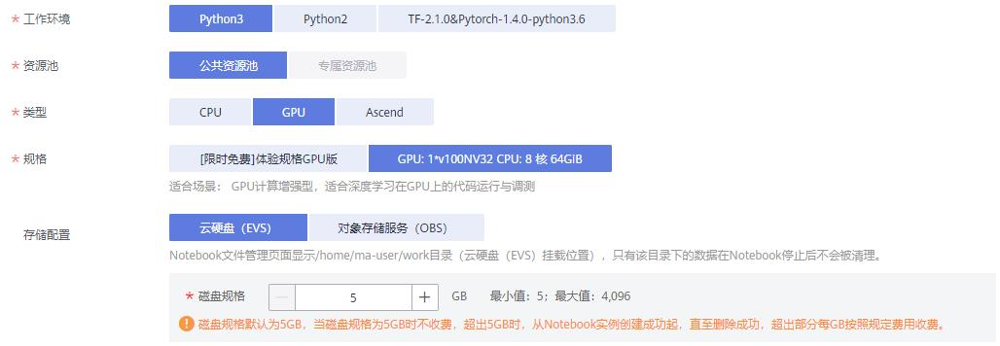

## MoXing超参搜索案例

[TOC]

### 1、超参搜索算法

#### 1.1 算法调用形式及参数说明

```
import moxing.tensorflow as mox

#进行搜索得到最优参数值
param_spec = mox.auto.search(input_fn, model_fn, optimizer_fn, batch_size,
                             auto_batch, total_steps, evaluation_total_steps,
                             model_size=None, by_acc=True, checkpoint_path=None,
                             select_by_eval=False, weight_decay_diff_thres=0.05,
                             max_thres=10, window=50, warmup_steps=0, warmup_lr=0.01,
                             evaluate_every_n_steps=1, log_every_n_steps=10,
                             init_learning_rate=None, end_learning_rate=None,
                             acc_name='accuracy', loss_name='loss',
                             search_learning_rate=True, param_spec=None,
                             param_list_spec=None)
```

|         参数名          | 是否必选 | 参数说明                                                     |
| :---------------------: | -------- | :----------------------------------------------------------- |
|        input_fn         | 必选     | 用户输入数据集                                               |
|        model_fn         | 必选     | 用户所建立的model_fn,返回mox.ModelSpec                       |
|      optimizer_fn       | 必选     | 用户所建立的optimizer_fn                                     |
|       batch_size        | 必选     | 用户选择的batch_size                                         |
|       auto_batch        | 必选     | 当input_fn中不包含batch_size维度时，需设置auto_batch=True,此时会以batch_size为单位进行聚合，并将包含batch_size维度的Tensor输入到model_fn |
|       total_steps       | 必选     | 预训练时训练的总步数                                         |
| evaluation_total_steps  | 必选     | 预训练时验证的总步数                                         |
|       param_spec        | 必选     | 预训练时的默认参数值                                         |
|     param_list_spec     | 必选     | 预训练时，待搜索参数值列表                                   |
|  search_learning_rate   | 可选     | True代表搜索learning rate，False代表不搜索learning rate      |
|       model_size        | 可选     | 代表模型复杂度，仅有以下两个值：ModelSize.LARGE,ModelSize.SMALL.如果未选，程序将自动很据模型参数个数判断模型复杂度 |
|         by_acc          | 可选     | True代表按照精度去判断参数优劣，False代表按照损失去判断参数优劣 |
|     checkpoint_path     | 可选     | 用户读取模型的地址                                           |
|     select_by_eval      | 可选     | 通过该参数控制在预训练的时是否执行加速算法，默认设置为True，不加速。 |
| weight_decay_diff_thres | 可选     | 用于判断两个weight_decay之前曲线的差异值                     |
|        max_thres        | 可选     | 用于选择最优lr的阈值，代表评估曲线最多允许下降的次数，若超过该值，代表之后的lr都会导致发散 |
|         window          | 可选     | 用于选择最优lr，评估曲线进行滑动平均的窗口的大小             |
|      warmup_steps       | 可选     | 预训练warmup的步数                                           |
|        warmup_lr        | 可选     | 预训练时warmup步数内的learning_rate                          |
| evaluate_every_n_steps  | 可选     | 预训练时，隔多久评估一次                                     |
|    log_every_n_steps    | 可选     | 日志隔多久记录一次                                           |
|   init_learning_rate    | 可选     | 搜索Lr的初始值，默认的话，程序将根据一定的规则自动选择       |
|    end_learning_rate    | 可选     | 搜索Lr的结束值，默认的话，程序将根据一定的规则自动选择       |
|        accuracy         | 可选     | 预训练时，评估的name                                         |
|        loss_name        | 可选     | 预训练时，评估的name                                         |

#### 1.2 算法策略

Moxing内置了HyperSelector超参自动选择算法，支持自定义搜索列表，通过设定`param_list_spec`的值，指定待搜索的参数和待搜索参数的列表。根据用户传入的参数进行预训练，得到的精度或者损失曲线，从而获取最优参数。其中`param_spec`存储初始参数值，用户通过自定义`model_fn()`和`optimizer_fn()`，使用`param_spec`中的参数。通过HyperSelector超参自动选择算法后，`param_spec`存储HyperSelector选择出的最优参数值。

#### 1.3 待搜索参数

支持的待搜索参数有：

- `learning_rate`:学习率，就是权重更新时的步长
- `momentum`:权重更新时的动量
- `weight_decay`:正则化系数
- `nms_score_threshold`：first_stage置信度阈值
- `nms_iou_threshold`：first_stage重叠率阈值
- `score_threshold`: 置信度阈值
- `iou_threshold`: 重叠率阈值

其中不同算法包含的参数不同：

- `two-stage algorithm`: faster-rcnn包含（nms_score_threshold,score_threshold,nms_iou_threshold，iou_threshold）
- `one-stage algorithm`: ssd包含这2个参数(score_threshold,iou_threshold)

例如在图像分类领域下，对`learning_rate`,`momentum`,`weight_decay`这三个参数进行自动选择。在目标检测的领域下，除了learning_rate,momentum,weight_decay以外，还可以增加`nms_score_threshold`,`score_threshold`,`nms_iou_threshold`，`iou_threshold`这4个参数的自动选择。目标检测和图像分类主要区别在于目标检测需要确定目标的位置，一般来说就需要确认候选框。这4个参数主要用于`non_max_suppression`,先按照`score_threshold`去除一些低于该值的框，然后按从大到小的方式排列所有的候选框。然后从大到小的方式一一比较框之间的重叠率，去掉重叠率超过`iou_threshold`的候选框，从而选出一系列置信度较高，无较大重合的候选框。


### 2、使用案例

基于[手写数字识别案例](https://support.huaweicloud.com/bestpractice-modelarts/modelarts_10_0008.html)，嵌入超参搜索功能。

#### 2.1 环境配置和数据准备

- 创建Notebook Python3 GPU开发环境：



​	创建完成后，打开一个Terminal，并切换至 TensorFlow-1.13.1 conda环境：

```
source /home/ma-user/anaconda3/bin/activate TensorFlow-1.13.1
```

- 数据准备：

  ```
  cd /home/ma-user/work
  mkdir data
  cd data
  wget https://modelarts-cnnorth1-market-dataset.obs.cn-north-1.myhuaweicloud.com/dataset-market/Mnist-Data-Set/archiver/Mnist-Data-Set.zip
  unzip Mnist-Data-Set.zip
  ```

#### 2.2 嵌入超参搜索

嵌入超参功能相关代码，基于[moxing实现手写数字识别代码](https://github.com/huaweicloud/ModelArts-Lab/tree/master/official_examples/Using_MoXing_to_Create_a_MNIST_Dataset_Recognition_Application/codes/train_mnist.py)

- 定义待超参搜索参数列表：

  ```
  param_spec = mox.auto.ParamSpec(weight_decay=1e-4,
                                  momentum=0.9,
                                  learning_rate=0.1)
  ```

- 定义待搜索参数值列表：

  ```
  param_list_spec = mox.auto.ParamSpec(weight_decay=[1e-2, 1e-3, 1e-4],
                                       momentum=[0.99, 0.95, 0.9])
  ```

- 启动参数搜索：

  ```
  param_spec = mox.auto.search(
          input_fn=input_fn,
          batch_size=50,
          model_fn=model_fn,
          optimizer_fn=optimizer_fn,
          auto_batch=False,
          select_by_eval=False,
          total_steps=100,
          evaluation_total_steps=10,
          param_spec=param_spec,
          param_list_spec=param_list_spec
      )
  ```

- 使用搜索得到的超参进行训练：

  ```
      mox.auto.run(input_fn=input_fn,
                   model_fn=model_fn,
                   optimizer_fn=optimizer_fn,
                   run_mode=mox.ModeKeys.TRAIN,
                   batch_size=50,
                   auto_batch=False,
                   log_dir=flags.train_url,
                   max_number_of_steps=1000,
                   log_every_n_steps=10,
                   export_model=mox.ExportKeys.TF_SERVING,
                   param_spec=param_spec)
      #调用方法由 mox.run 替换成 mox.auto.run, 并添加param_spec参数
  ```


### 附录

#### 基于[moxing实现手写数字识别代码](https://github.com/huaweicloud/ModelArts-Lab/tree/master/official_examples/Using_MoXing_to_Create_a_MNIST_Dataset_Recognition_Application/codes/train_mnist.py)修改后的完整代码

```
# -*- coding: UTF-8 -*-
# Copyright 2020 ModelArts Authors from Huawei Cloud. All Rights Reserved.
# https://www.huaweicloud.com/product/modelarts.html
#
# Licensed under the Apache License, Version 2.0 (the "License");
# you may not use this file except in compliance with the License.
# You may obtain a copy of the License at
#
# http://www.apache.org/licenses/LICENSE-2.0
#
# Unless required by applicable law or agreed to in writing, software
# distributed under the License is distributed on an "AS IS" BASIS,
# WITHOUT WARRANTIES OR CONDITIONS OF ANY KIND, either express or implied.
# See the License for the specific language governing permissions and
# limitations under the License.
# ==============================================================================

from __future__ import absolute_import
from __future__ import division
from __future__ import print_function

from tensorflow.examples.tutorials.mnist import input_data
import tensorflow as tf
import moxing.tensorflow as mox
import os
import time

tf.flags.DEFINE_string('data_url', '/home/ma-user/work/data', 'Dir of dataset')
tf.flags.DEFINE_string('train_url', '/home/ma-user/work/out', 'Train Url')
flags = tf.flags.FLAGS


def check_dataset():
    work_directory = flags.data_url
    filenames = ['train-images-idx3-ubyte.gz', 'train-labels-idx1-ubyte.gz', 't10k-images-idx3-ubyte.gz',
                 't10k-labels-idx1-ubyte.gz']
    for filename in filenames:
        filepath = os.path.join(work_directory, filename)
        if not mox.file.exists(filepath):
            raise ValueError('MNIST dataset file %s not found in %s' % (filepath, work_directory))

def optimizer_fn(**kwargs):
    """get the optimizer"""
    param_spec = kwargs['param_spec']
    learning_rate = param_spec.learning_rate
    opt = mox.get_optimizer_fn(name='momentum', learning_rate=learning_rate,
                               momentum=param_spec.momentum)()
    return opt

def main(*args, **kwargs):
    check_dataset()
    mnist = input_data.read_data_sets(flags.data_url, one_hot=True)

    # define the input dataset, return image and label
    def input_fn(run_mode, **kwargs):

        def gen():
            while True:
                yield mnist.train.next_batch(50)

        ds = tf.data.Dataset.from_generator(
            gen, output_types=(tf.float32, tf.int64),
            output_shapes=(tf.TensorShape([None, 784]), tf.TensorShape([None, 10])))
        return ds.make_one_shot_iterator().get_next()

    # define the model for training or evaling.
    def model_fn(inputs, run_mode, **kwargs):
        x, y_ = inputs
        W = tf.get_variable(name='W', initializer=tf.zeros([784, 10]))
        b = tf.get_variable(name='b', initializer=tf.zeros([10]))
        y = tf.matmul(x, W) + b
        cross_entropy = tf.reduce_mean(
            tf.nn.softmax_cross_entropy_with_logits(labels=y_, logits=y))
        correct_prediction = tf.equal(tf.argmax(y, 1), tf.argmax(y_, 1))
        accuracy = tf.reduce_mean(tf.cast(correct_prediction, tf.float32))
        export_spec = mox.ExportSpec(inputs_dict={'images': x}, outputs_dict={'logits': y}, version='model')
        return mox.ModelSpec(loss=cross_entropy, log_info={'loss': cross_entropy, 'accuracy': accuracy},
                             export_spec=export_spec)

    start_time = time.time()
    param_spec = mox.auto.ParamSpec(weight_decay=1e-4,
                                    momentum=0.9,
                                    learning_rate=0.1)

    param_list_spec = mox.auto.ParamSpec(weight_decay=[1e-2, 1e-3, 1e-4],
                                         momentum=[0.99, 0.95, 0.9])

    param_spec = mox.auto.search(
        input_fn=input_fn,
        batch_size=50,
        model_fn=model_fn,
        optimizer_fn=optimizer_fn,
        auto_batch=False,
        select_by_eval=False,
        total_steps=100,
        evaluation_total_steps=10,
        param_spec=param_spec,
        param_list_spec=param_list_spec
    )

    end_time_hyper = time.time()

    tf.logging.info("Best lr %f, Best weight_decay %f, Best momentum %f, searchtime %f s",
                    param_spec.learning_rate,
                    param_spec.weight_decay,
                    param_spec.momentum,
                    end_time_hyper - start_time)


    mox.auto.run(input_fn=input_fn,
                 model_fn=model_fn,
                 optimizer_fn=optimizer_fn,
                 run_mode=mox.ModeKeys.TRAIN,
                 batch_size=50,
                 auto_batch=False,
                 log_dir=flags.train_url,
                 max_number_of_steps=1000,
                 log_every_n_steps=10,
                 export_model=mox.ExportKeys.TF_SERVING,
                 param_spec=param_spec)

if __name__ == '__main__':
  tf.app.run(main=main)
```

